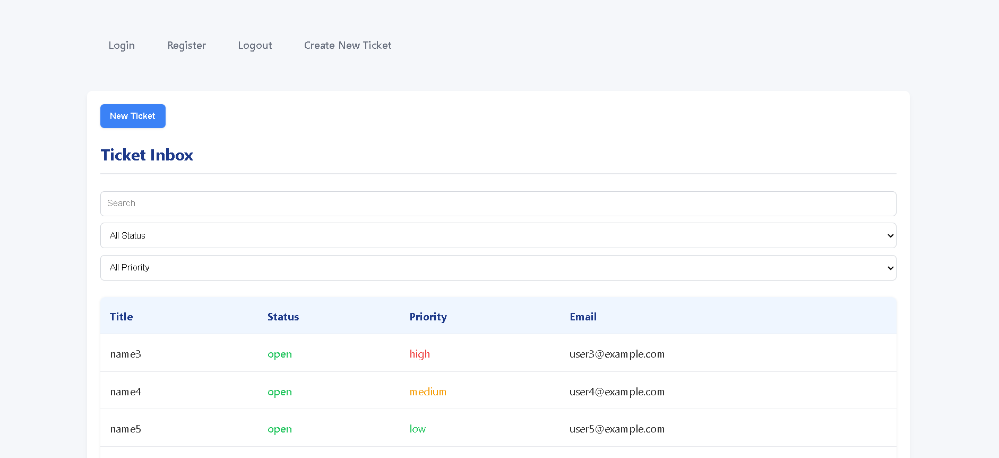
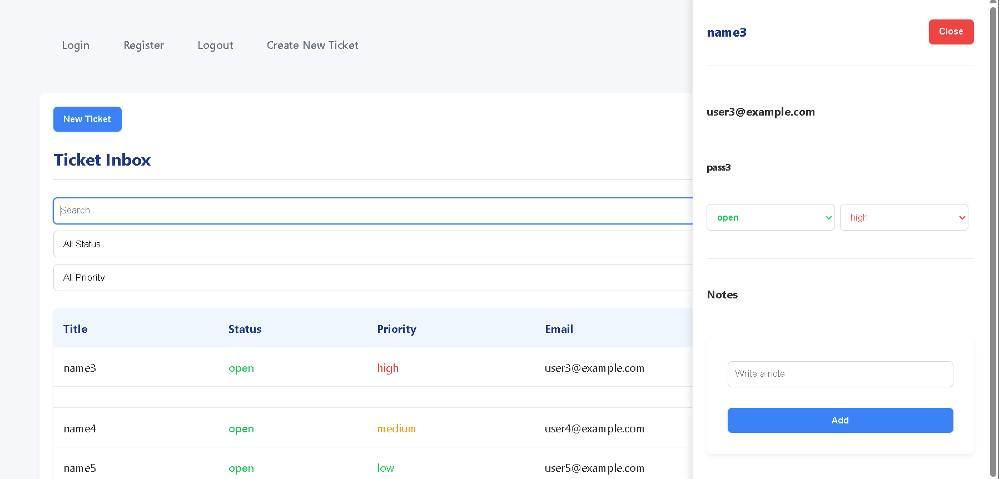
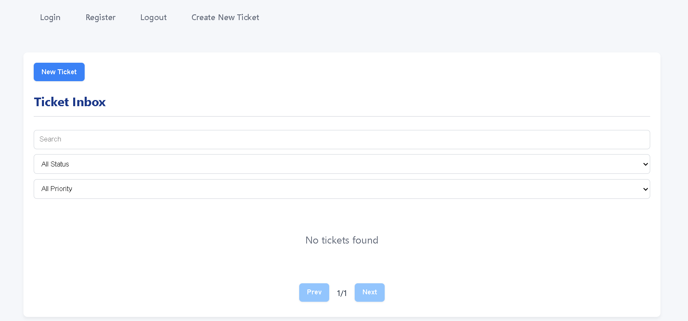

   // Ticket Inbox //

This project is a mini inbox system built using vite React for the frontend and Node.js with Express for the backend.  
It allows support agents to manage customer tickets, update their status, priorities, and add internal notes.
The inbox refreshes automatically and supports basic collaboration features.


=> Features

*** Backend

-> Authentication
- `POST /auth/register` → Register a new user
- `POST /auth/login` → Login user and return JWT token
- Passwords are securely stored using bcrypt

-> Tickets
- `GET /tickets` → get all tickets  
  - Supports pagination
  - Filter by status and priority  
  - Search by title or customer email
- `GET /tickets/:id` → Get ticket details by ID
- `PATCH /tickets/:id` → Update ticket status and priority
- `DELETE /tickets/:id` → Soft delete a ticket

-> Notes
- `GET /tickets/:id/notes` → Fetch notes related to a ticket
- `POST /tickets/:id/notes` → Add a new note  
  - Only accessible to authenticated users

-> Validation and Error Handling
- Request body validation is implemented
- Consistent and structured error responses across APIs

---

*** Frontend

-> Authentication
- Login and Register pages
- JWT token stored in localStorage
- Protected routes for authenticated users

-> Ticket Inbox
- Tickets displayed in table or list view
- Filters for status and priority
- Search functionality
- Pagination or load-more support
- Clicking a ticket opens a detail view (side drawer or modal)

-> Ticket Details
- Displays complete ticket information
- Allows changing status and priority
- Shows notes list (latest first)
- Input field to add new notes

-> Optimistic Updates
- UI updates immediately when status, priority, or notes change
- Automatically rolls back if API request fails

-> Auto Refresh
- Ticket inbox refreshes every 10 seconds
- Filters, pagination, and scroll position remain unchanged

-> Empty and Error States
- Loading indicators or skeletons
- Error messages or toast notifications
- “No tickets found” message when applicable

---

***  Screenshots

(Add screenshots here to demonstrate the UI)




---

***  Tech Stack

- Frontend: React, React Query, Tailwind CSS
- Backend: Node.js, Express
- Database: PostgreSQL
- Authentication: JWT, bcrypt, zod

---

*** Setup Instructions

=> Backend

Navigate to the backend folder:
```bash
cd backend

npm install

PORT=5000

JWT_SECRET=your_jwt_secret

DATABASE_URL=./database.sqlite

npm run dev

http://localhost:5000
  

--- 


=>  Frontend

Navigate to the frontend folder:
```bash
cd front

npm install

VITE_API_BASE_URL=http://localhost:5000

npm run dev

http://localhost:5173

--- 


***  Known Limitations

- Ticket statistics endpoint is not implemented
- No real-time update indicator for modified tickets
- WebSocket-based real-time updates are not added

---

*** Future Improvements

- Add GET /stats endpoint for ticket analytics
- Add role-based access control
- Implement WebSocket support for real-time updates
- Improve UI with better animations and accessibility
- Deploy using Docker and cloud services

---

*** Final Note

This project was built to demonstrate fullstack development skills,including authentication, CRUD operations, validation, pagination,search functionality, and clean frontend-backend integration.


